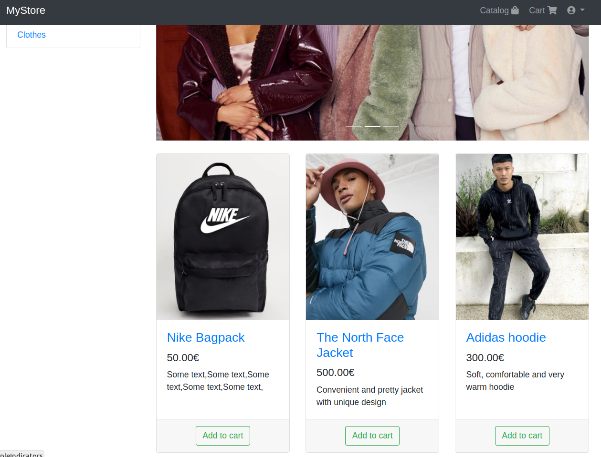
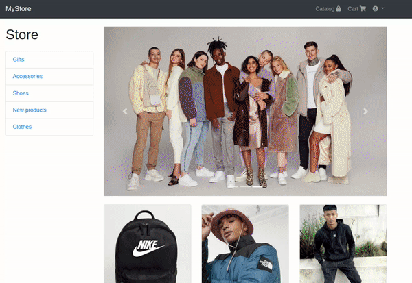

# <div align="center">CLOTHING STORE 🛍️</div>

<div align="center">

</div>

<br/>

I made this django project to explore new technologies and libraries, as well as hone my docker containerization skill.
In this project, I have collected the most popular and necessary tools for creating complex and full-fledged projects.

## Description

<div align="center">

</div>

<br/>

This is one of the most complex Django projects that I have implemented to date. I created an online store where you can
log in through social networks or register, receive email confirmation letters, purchase various products, sort them by
categories, and then pay through the Stripe system. You can also see a list of all your orders and their status. This is
a fully functional and ready-to-use online store.

Since I position myself as a backend developer, I focused on the internal components, not the appearance of the
site.

## Technologies

***Languages***


***Framework***


***Databases***


***Libraries***


***Other***


## Project setup

***Method 1: Via docker-compose***

1. Create a .env file and paste the data from the .env.example file into it
2. In REDIS_HOST and POSTGRES_HOST, specify the names of docker-compose services (redis and db)
3. In BOT_TOKEN, specify the token of your telegram bot created earlier via BotFather
4. In the terminal, enter the following command:

```
docker-compose up --build
```

***Method 2: Via virtual environment***

1. Create and activate a python virtual environment
2. In the terminal, enter the following command:

```
pip3 install -r requirements.txt
```

3. Create a .env file and paste the data from the .env.example file into it
4. In REDIS_HOST and POSTGRES_HOST, specify localhost
5. In BOT_TOKEN, specify the token of your telegram bot created earlier via BotFather
6. Run the file bot.py

## <div align="center">Thank you for taking the time to review my project. Enjoy reading!👋</div>