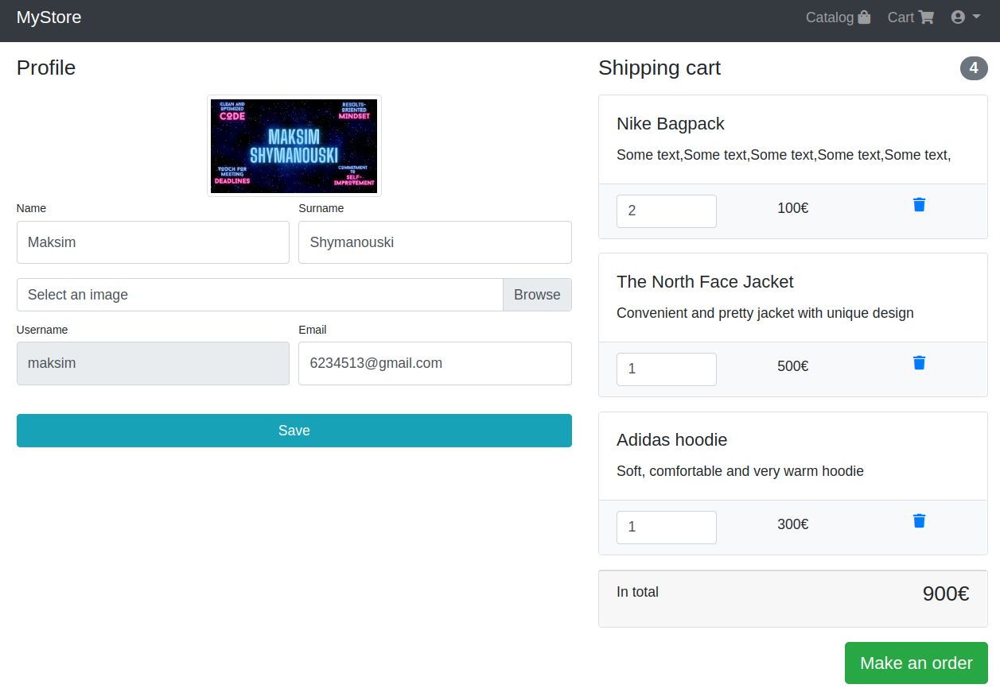
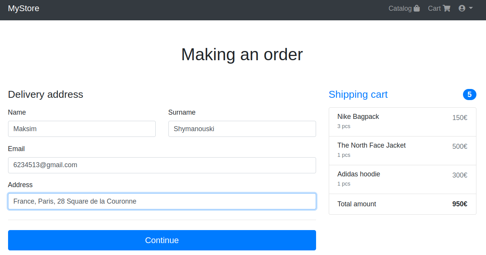
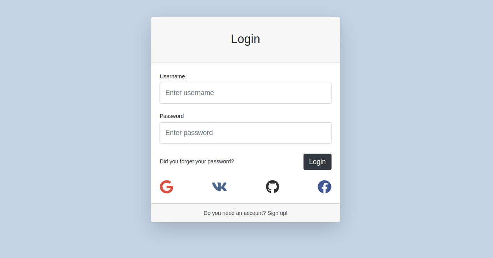

# <div align="center">CLOTHING STORE 🛍️</div>

<div align="center">

</div>


<br/>
While reading a course on creating telegram bots, I saw a comment from the person who created the telegram bot sea
battle. I also wanted to create my own bot, but using modern technologies, libraries, databases and optimization.

## Description

<div align="center">

</div>

<div align="center">

</div>
<div align="center">

</div>

<br/>

My project is a full-fledged bot created to read books directly from telegram. You can select a book, flip through the
pages, go to the table of contents and select the desired page there, add pages to bookmarks, click on them and delete
them. There are also convenient commands for going to the beginning of the book or continuing reading from the place
where you finished.

## Technologies

***Languages***


***Framework***


***Databases***


***Libraries***


***Other***


I wrote a python bot using aiogram. I used two databases: Postgresql for storing user data, books and bookmarks, and
Redis for caching data and optimizing work. The bot takes data about books via API from a [third-party service](https://github.com/brestok-1/drf-tg-data) and stores
them in the database. With the help of the Aiocron library, the database is updated every hour. I also connected an
alembic to initialize the database and create migrations

## Project setup

***Method 1: Via docker-compose***

1. Create a .env file and paste the data from the .env.example file into it
2. In REDIS_HOST and POSTGRES_HOST, specify the names of docker-compose services (redis and db)
3. In BOT_TOKEN, specify the token of your telegram bot created earlier via BotFather
4. In the terminal, enter the following command:

```
docker-compose up --build
```

***Method 2: Via virtual environment***

1. Create and activate a python virtual environment
2. In the terminal, enter the following command:

```
pip3 install -r requirements.txt
```

3. Create a .env file and paste the data from the .env.example file into it
4. In REDIS_HOST and POSTGRES_HOST, specify localhost
5. In BOT_TOKEN, specify the token of your telegram bot created earlier via BotFather
6. Run the file bot.py

## <div align="center">Thank you for taking the time to review my project. Enjoy reading!👋</div>